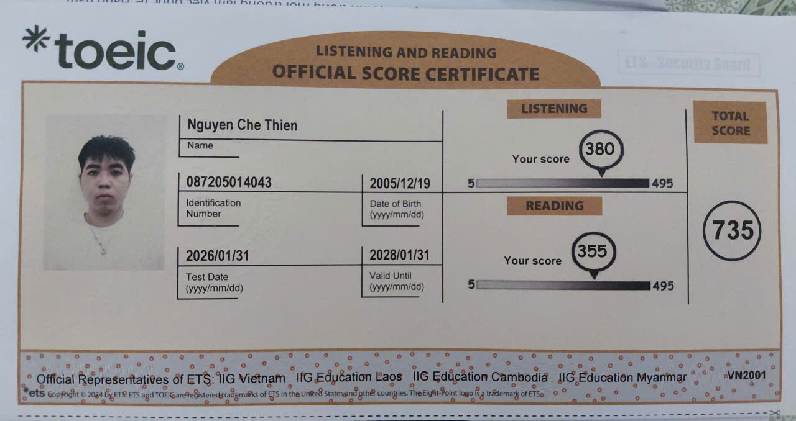
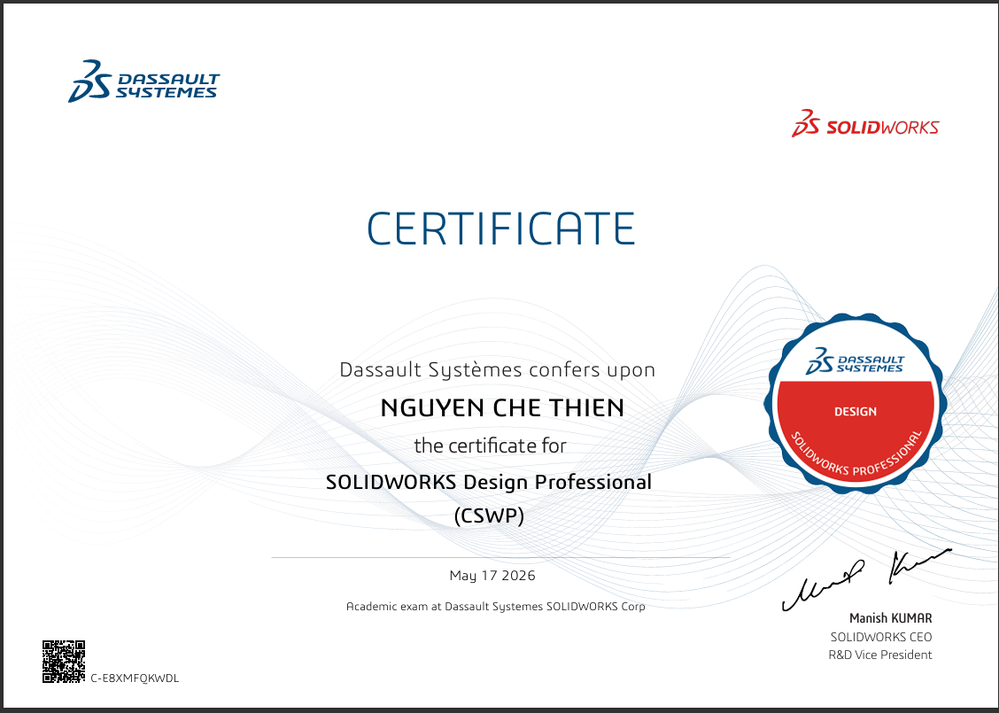
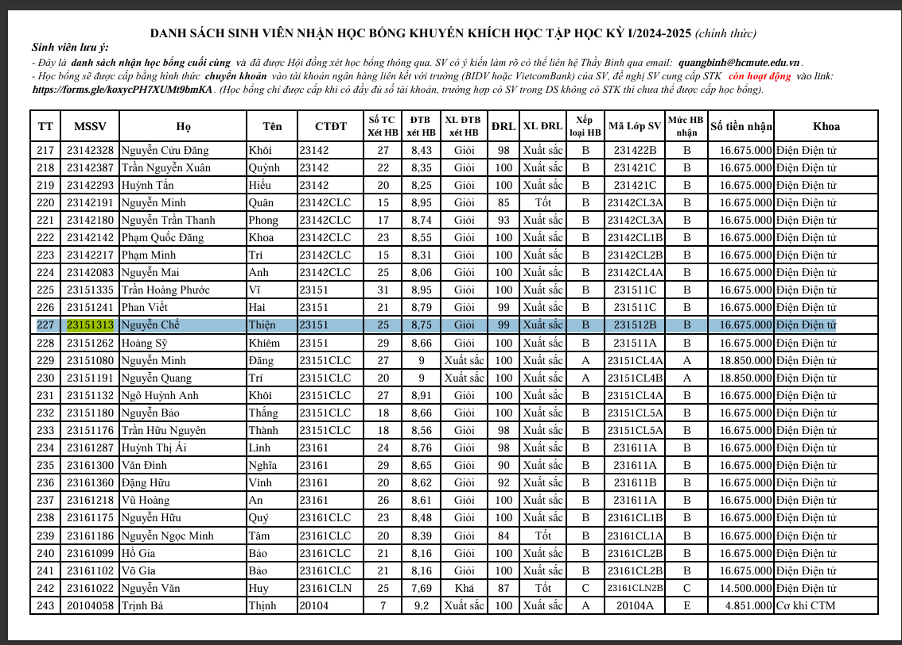
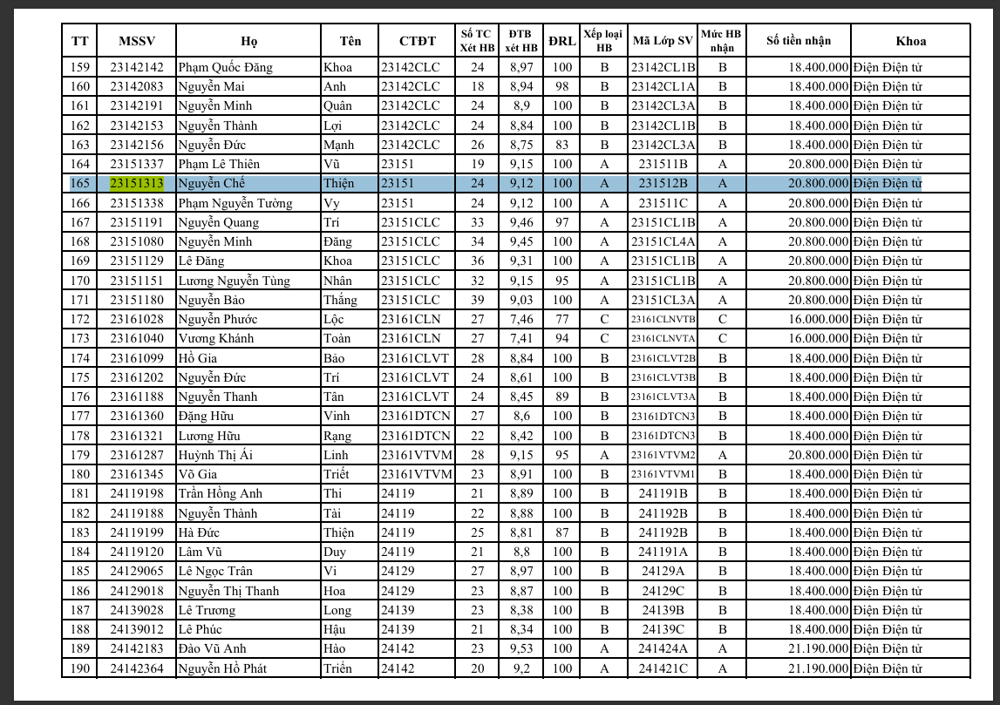

# Nguyen Che Thien / Chethien1912

## WELCOME TO MY PAGE 👋👋👋👋

I'm Nguyen Che Thien, a third-year student at Ho Chi Minh City University of Technology and Education (HCMUTE) who focuses on embedded systems, PCB design, robotics, and SolidWorks.

### 📫 How to Reach Me

[GitHub](https://github.com/Chethien1912) • [Facebook](https://www.facebook.com/) • [LinkedIn](https://www.linkedin.com/in/) • [Email](mailto:nguyenchethien.1912@gmail.com)

###  About Me

- I am passionate about embedded systems, PCB design, robotics, and SolidWorks.
- I enjoy solving real problems with practical, hands-on engineering solutions.
- My goal is to keep learning, keep building, and share useful projects with the community.

###  Education

- Ho Chi Minh City University of Technology and Education (HCMUTE) – Third-year student
- [Previous School] – [Specialization or track]
- My major is Control and Automation Engineering.

### 🏆 Achievements & Certifications

#### TOEIC 735

	

#### SolidWorks CSWP

	

#### Scholarship Awards

	

	

###  Projects & Contributions

I work on projects related to embedded systems, PCB design, robotics, and SolidWorks. My repositories already contain my projects, so you can explore them directly on my profile.
---

Let's connect and build something useful together!
