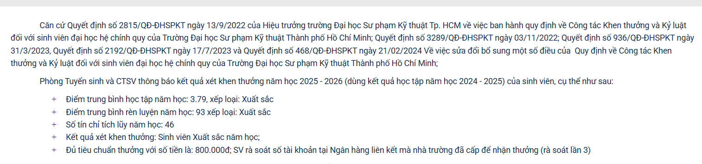

# Nguyen Che Thien / Chethien1912

## WELCOME TO MY PAGE 👋👋👋👋

I'm Nguyen Che Thien, a third-year student at HCMUTE who focuses on embedded systems, PCB design, robotics, and SolidWorks.

### 📫 How to Reach Me

[GitHub](https://github.com/Chethien1912) • [Facebook](https://www.facebook.com/) • [LinkedIn](https://www.linkedin.com/in/) • [Email](nguyenchethien.1012@gmail.com)

### 🛠️ About Me

- I am passionate about embedded systems, PCB design, robotics, and SolidWorks.
- I enjoy solving real problems with practical, hands-on engineering solutions.
- My goal is to keep learning, keep building, and share useful projects with the community.

### 🎓 Education

- Ho Chi Minh City University of Technology and Education (HCMUTE) – Third-year student
- [Previous School] – [Specialization or track]

### 🏆 Achievements & Certifications

- TOEIC 735
- SolidWorks CSWP (Certified SolidWorks Professional)
- 2 lần đạt học bổng kỳ

	

### 📌 Projects & Contributions

I like working on projects related to embedded systems, PCB design, robotics, and SolidWorks. My repositories already contain my projects, so you can explore them directly on my profile.

### 💡 Languages & Tools

### ⚡ GitHub Stats

### 🔥 Most Used Languages

---

💡 Let's connect and build something useful together! 🚀
